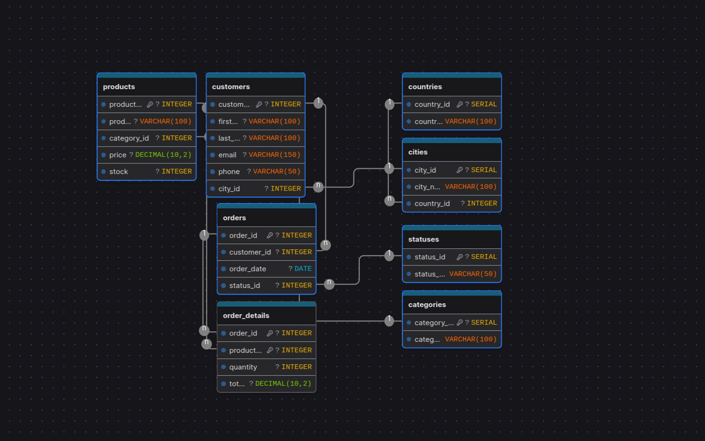
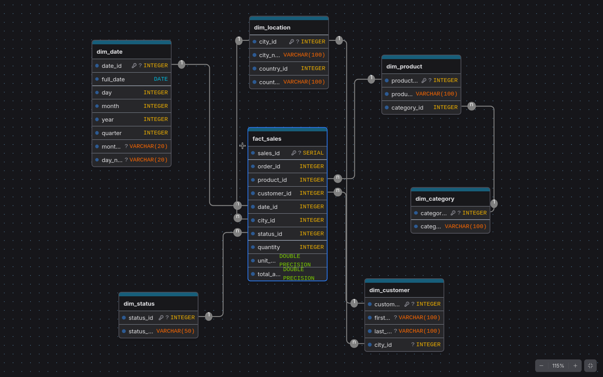

# Sales system analytics with ETL.

This project is part of the subject of Big Data, where we will analyze the sales system of a company using ETL (Extract, Transform, Load) processes. The goal is to extract data from various sources, transform it into a suitable format, and load it into a data warehouse for analysis.

Our task was to create a Rest API and a Transactional Database to store the data, and then use ETL processes to extract the data from those sources and csv files, transform it into a suitable format, and load it into a data warehouse for analysis.

## Part of the project
- ETL: I build the ELT process with Rust because is a programming language i am learning and it was interesting to me use it for the project and learn more about it.
- Rest API: The Rest API is a single one with just 2 endpoints build with BunJS.
- Trasactional database: Ultimately, the trasactional database is a PostgreSQL 

### Trasactional Database schema

### Analytics Database schema

## Todo's left
- [ ] Create Transform and load module.
